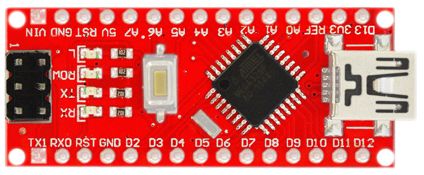
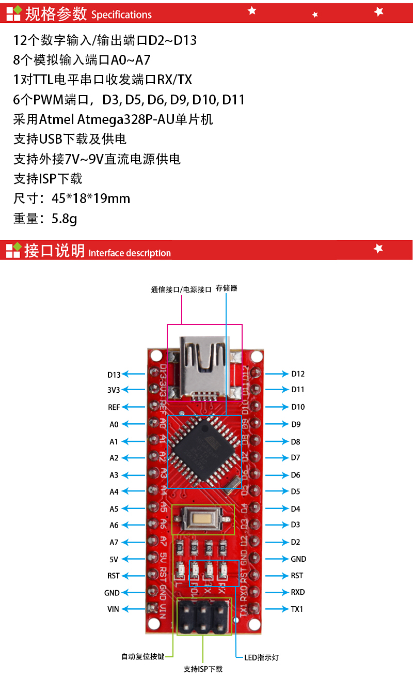
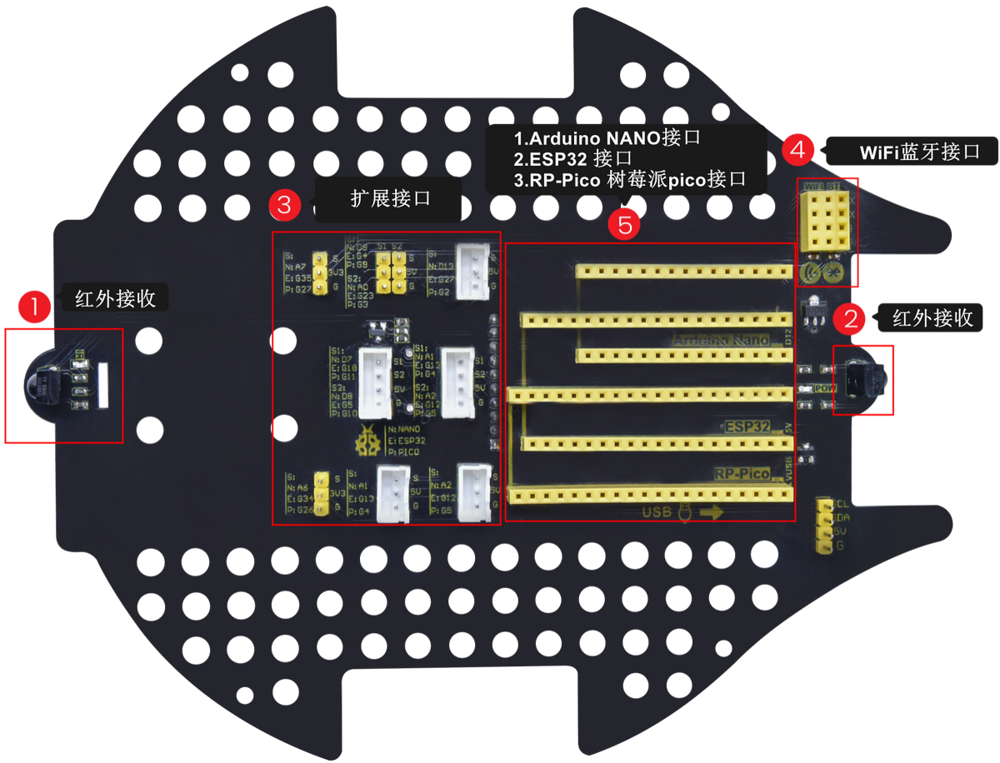
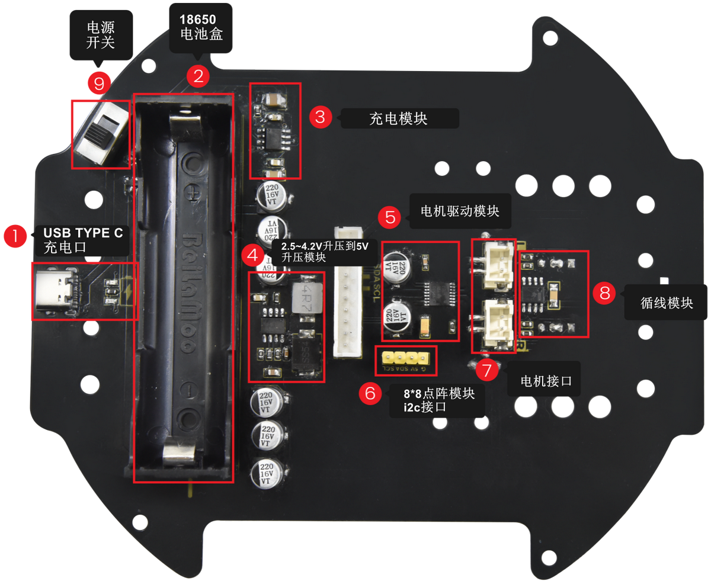

Nano开发板和扩展板
==================

**keyes Nano 开发板**
---------------------

在开始所有的项目之前，我们首先要了解下面这片keyes
NANO开发板，是这个项目的核心开发板。

|img|

Keyes NANO的处理器核心是ATMEGA328P-AU。和官网的ARDUINO NANO对比，Keyes
NANO使用的USB转串口芯片为CH340，安装的驱动文件不一样，其他的使用方法完全一样。

它同时具有14路数字输入/输出口（其中6路可作为PWM输出），8路模拟输入，1个16MHz晶体振荡器，1个Type-C
USB接口，1个ICSP接口和一个复位按钮。

其中ICSP接口是用来给ATMEGA328P-AU烧录固件，由于这个该芯片我们在出厂前都以烧录好固件，所以一般不用。使用时我们可以利用Type-C
USB线供电，，还可以利用排母接口VIN GND（DC 7-12V）供电。

|image1|

​它包含支持微控制器所需的一切，可以通过连接排针Vin 和GND（DC
7-12V)接口和USB电源即可启动。

**扩展板介绍**
--------------

- 套件中NANO开发板，详细参数请参考链接：\ http://www.keyes-robot.com/pd.jsp?id=62&fromColId=0#_pp=0_449_3

- 扩展板介绍：

  |image2|

- 驱动板介绍：

|image3|

