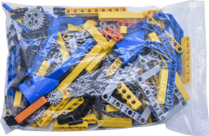
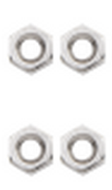
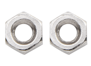

产品介绍
========

|KE3066 三合一积木车Nano-3|

--------------

**介绍**
--------

- Beetlebot智能小车是兼容乐高积木的STEM教育产品。它能躲避路障、循黑线行驶，识别光线，并可通过红外或WIFI遥控。它有三种外形：足球机器人、投石攻城车和搬运机器人，也可自由发挥，提升创造力。

- Beetlebot革新了电机驱动和传感器设计，集成式结构功能可靠且安装简便。控制核心采用开源硬件Arduino，可实现低成本的Arduino编程学习计划。

- Beetlebot培养编程、人工智能应用、创新思维、动手实践、解决问题和团队协作能力。例如，孩子们可以用编程的Beetlebot进行足球比赛或攻城对战游戏，非常有趣！

**特点**
--------

1. 兼容乐高积木：可以用乐高积木扩展外形和增加兼容乐高的传感器。
2. 三种机器人外形：足球机器人，投石攻城车，搬运机器人。
3. 功能丰富：有表情显示，氛围灯控制，循迹，避障，追光，红外控制，WIFI控制。
4. 安装简单：车体采用嵌入式设计，只需要几个步骤就可以完成车体的安装和接线。
5. 兼容性强：车体预留了raspberriy
   pico和ESP32控制板的插口，兼容这两种开发板。
6. 充电功能:集成了18650锂电池的充放电的电路，使用起来更经济便捷。
7. WiFi控制：小车采用的是WiFi控制，有能力的朋友可以在此基础上进行二次开发。
8. 小车APP：兼容Android和iOS系统，精美的软件界面和丰富灵活的控制系统。

--------------

**参数**
--------

工作电压：5V

电池输入电压：2.5V~4.2V（单节锂电池）

最大输出电流：≤3A

最大耗散功率：≤15W

WiFi工作频率：2.4G

电机转速：200rpm/min(5V电压)

电机驱动形式：双路H桥

超声波感应角度：<15度

超声波探测距离：2cm~400cm

红外遥控距离：7m左右

安装后尺寸：176*137*130mm±1%

工作温度：–10至+65摄氏度

--------------

清单
----

**当收到这个产品时，请根据清单进行清点，以确保所有配件完整无损。如果发现有缺失的配件，请立即联系我们的销售人员。**

==== ========= =================================== ======
序号 图片      规格                                倍用量
==== ========= =================================== ======
1    |img|     keyes NANO for arduino 开发板 红色  1
2    |image1|  ESP8266串口WIFI ESP-01 WEBDUINO专用 1
3    |image2|  光敏电阻传感器                      2
4    |image3|  乐高舵机 270°舵机                   1
5    |image4|  扩展板                              1
6    |image5|  驱动板                              1
7    |image6|  乐高套件                            1
8    |image7|  亚克力垫高板                        1
9    |image8|  超声波固定亚克力折弯板              1
10   |image9|  乐高孔位亚克力舵机固定平台          1
11   |image10| 马达                                2
12   |image11| 8X8点阵模块                         1
13   |image12| 马达固定部件                        2
14   |image13| 9G 舵机180度                        1
15   |image14| 轮胎                                2
16   |image15| 超声波传感器                        1
17   |image16| 红黑色 十字螺丝刀                   1
18   |image17| 万向轮                              1
19   |image18| USB MINI5P 蓝色                     1
20   |image19| 遥控器                              1
21   |image20| USB type-c                          1
22   |image21| 紫黑色 十字螺丝刀                   1
23   |image22| XH2.54-3Pin+杜邦母单                2
24   |image23| 4P 杜邦母对母连拼                   1
25   |image24| HX2.54mm-4P转2.54杜邦母单           1
26   |image25| 缠绕管                              1
27   |image26| 10P XH2.54白色端子                  1
28   |image27| 乐高摩擦销用亚克力垫片              1
29   |image28| 六角铜柱                            4
30   |image29| 自攻螺钉                            4
31   |image30| 镀镍螺母                            4
32   |image31| 不锈钢螺钉                          4
33   |image32| 镀镍螺母                            2
34   |image33| 十字螺钉                            2
35   |image34| 十字螺钉                            6
36   |image35| 十字螺钉                            10
37   |image36| 镀镍螺母                            8
38   |image37| 十字螺钉                            4
39   |image38| 桌上足球                            1
40   |image39| 钢珠万向轮                          1
41   |image40| 18650电池                           1
42   |image41| USB转ESP-01S WIFI模块串口测试扩展板 1
43   |image42| 寻迹跑道                            1
44   |image43| 圆头十字 自攻螺丝                   2
==== ========= =================================== ======

.. |img| image:: ./img/f2e6bac5a0d04d0ce618ab34349843df.png
.. |image1| image:: ./img/6cfe76c4bb5f0ff5ce6337599848b09a.png
.. |image2| image:: ./img/ec74f82d06b16b316d062402cca289af.png

.. |image4| image:: ./img/ef27a084499a76e845d8e06adaff5118.png
.. |image5| image:: ./img/31370ce9ba0b05e5a9c144b16936b611.png

.. |image7| image:: ./img/55512966ecc507566abfdb2621501cec.png
.. |image8| image:: ./img/b4182724db3cf3acb1b0639ab4b2f816.png
.. |image9| image:: ./img/c25250bc0a2d62bfcf6fa09f27d64a62.png

.. |image11| image:: ./img/e0cf693bd9cb81b13a7f2f9a878abd4d.png
.. |image12| image:: ./img/43d6e5b9554a86660d9fa0cd843b3588.png
.. |image13| image:: ./img/6314bf6e49bab80903591078fbddc3c3.png
.. |image14| image:: ./img/740465c79665be99dcb107b8fc0cfd99.png
.. |image15| image:: ./img/df0837b880cecfb56a8b6b5938b3d07f.png
.. |image16| image:: ./img/9b9894b471c28b35025398035763a385.png
.. |image17| image:: ./img/246c4c31eb60ddbb5b370be872ad3a86.png
.. |image18| image:: ./img/25b35b7f27e7b9bddbba3862530f0080.png
.. |image19| image:: ./img/6375490a4139768f511d719a53e3c567.png
.. |image20| image:: ./img/d4a64f124740d302a333214d6eb6ca93.png

.. |image22| image:: ./img/668e954c302037b38d1a52ad6cb0cb7c.png
.. |image23| image:: ./img/245a4769c1eaef5a022941eb44b3d5cf.png
.. |image24| image:: ./img/7bf18a9494bfc4eefeb233deb8916da9.png
.. |image25| image:: ./img/c367a9501ea69a6346f3b9cdcd90cc7e.png
.. |image26| image:: ./img/c925ea03d1cd5bb533a641b8434368ae.png
.. |image27| image:: ./img/47df7e4bcd4b364156f6bbd38dd3e0e7.png
.. |image28| image:: ./img/3ca9a21594498bb7b382af9ded0c7170.png
.. |image29| image:: ./img/0a16cc7e8e977fbb7e789bd157afa4fb.png

.. |image33| image:: ./img/c4f089d934a51b90dd0d1cd53146734b.png
.. |image34| image:: ./img/aa376cc1ecef9c2f46bcdee790bebf83.png
.. |image35| image:: ./img/27a9102cbdd161980614184c891f4f37.png
.. |image36| image:: ./img/faf5f791348c37566bf434f8b20a72b5.png
.. |image37| image:: ./img/ab1a6cb4fad235a5b1c780f1a9fb6524.png

.. |image39| image:: ./img/6cd1b9bc91b269a20d0d4d9f45ac9f24.png
.. |image40| image:: ./img/e65413d13672bd3c9cc6c216463e06e0.png
.. |image41| image:: ./img/38189572cfc730c2873b2916bde7b88f.png
.. |image42| image:: ./img/c7fc4c40d84df62ff689b23ea55b291d.png

