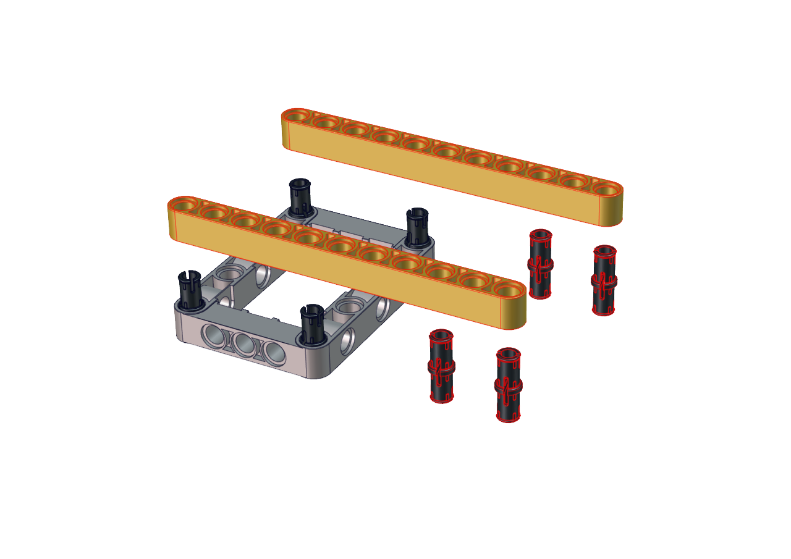
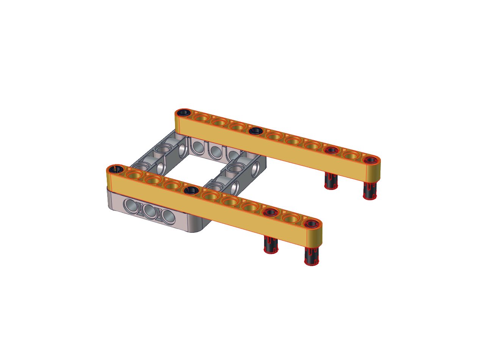
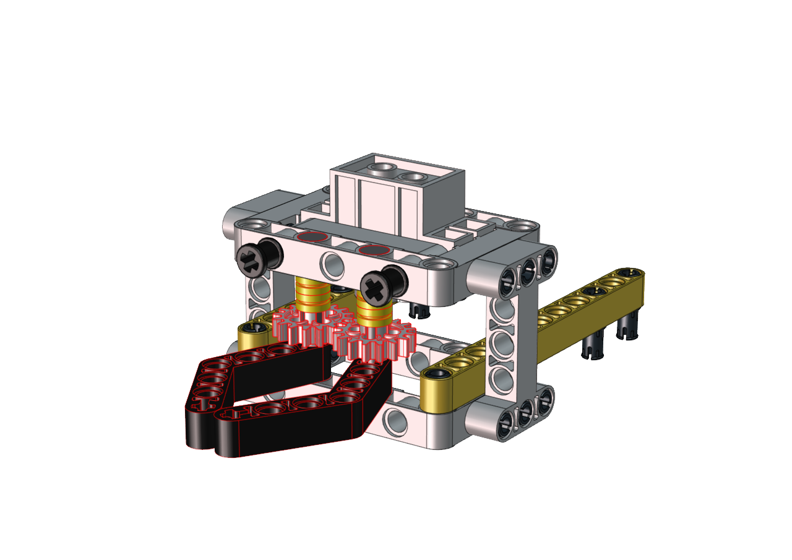
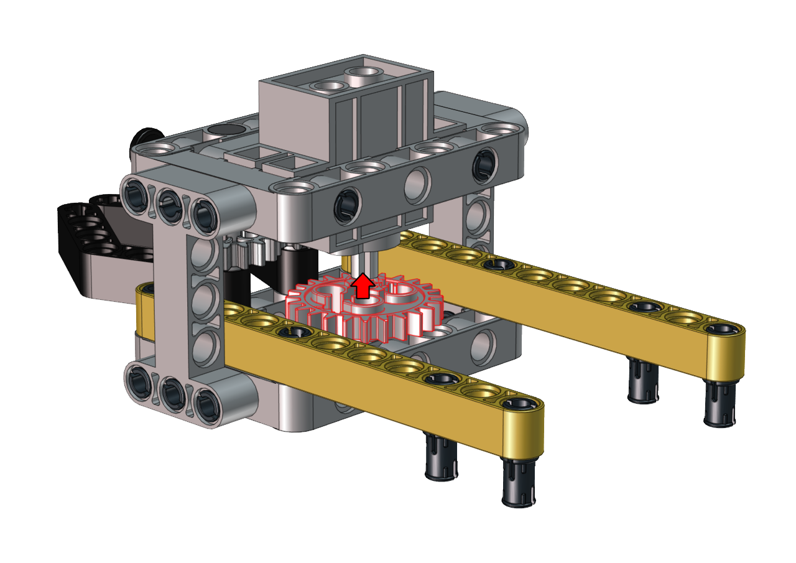

足球机器人形态安装步骤
======================

先将两个光敏传感器拆下

|img|

--------------

安装所需零件
------------

|image1|

--------------

安装

|image2|

--------------

完成

|image3|

--------------

.. _安装所需零件-1:

安装所需零件
------------

|image4|

--------------

安装

|image5|

--------------

完成

|image6|

--------------

.. _安装所需零件-2:

安装所需零件
------------

|image7|

--------------

安装

|image8|

--------------

完成

|image9|

--------------

.. _安装所需零件-3:

安装所需零件
------------

|image10|

--------------

安装

|image11|

--------------

完成

|image12|

--------------

.. _安装所需零件-4:

安装所需零件
------------

|image13|

--------------

安装

|image14|

--------------

完成

|image15|

--------------

.. _安装所需零件-5:

安装所需零件
------------

|image16|

--------------

安装（注意红圈内凸起朝右）

|image17|

--------------

完成

|image18|

--------------

.. _安装所需零件-6:

安装所需零件
------------

|image19|

--------------

安装

|image20|

--------------

完成

|image21|

--------------

.. _安装所需零件-7:

安装所需零件
------------

|image22|

--------------

安装（注意调整夹爪角度，使其闭合朝前）

|image23|

--------------

完成

|image24|

--------------

.. _安装所需零件-8:

安装所需零件
------------

|image25|

--------------

注意在安装前需要先调节舵机角度为180度

**将舵机的线接到PCB上板的S2接口，如下表:**

====== =========
舵机   小车PCB板
====== =========
棕线   G
红线   5V
橙黄线 S2（A0）
====== =========

代码：

.. code:: c++

   #include <Servo.h>
   Servo myservo;  // create servo object to control a servo

   void setup() {
     myservo.attach(A0);  // attaches the servo on pin A0 to the servo object
   }

   void loop() {
     myservo.write(180);  // tell servo to go to position
   }

上面的Arduino代码在资料中有提供，打开舵机的调整代码并烧录到Beetlebot的主板，完成。代码如下图位置:

|image26|

也可以使用Scratch代码来调整舵机初始角度：

|image27|

Scratch代码在资料中也有提供，打开舵机的调整代码并烧录到Beetlebot的主板，完成。代码如下图位置:

|image28|

安装（齿轮安装时保持夹爪为闭合朝前状态）

|image29|

--------------

完成

|image30|

--------------

安装所需零件

|image31|

--------------

安装

|image32|

--------------

完成

|image33|

--------------

安装所需零件

|image34|

--------------

安装

|image35|

--------------

完成

|image36|

--------------

足球小将形态完成

|image37|

--------------

乐高舵机接线图

|image38|

.. |img| image:: ./img/5e64e86f88135f370916439bbabb2d5a.png
.. |image1| image:: ./img/52bddcd05b409305adfbb39a9af55ee6.png
.. |image2| image:: ./img/9b295f5c6b71340264eb54fd701296d6.png
.. |image3| image:: ./img/448e4708895f49afd985391c8ac0cd04.png
.. |image4| image:: ./img/b7ca00b9d07fc08780f5e6e39595d974.png
.. |image5| image:: ./img/d124cb9095a9cecb1eea4c9b565da3dd.png
.. |image6| image:: ./img/ef1331144242e5bc24bc426842d98573.png
.. |image7| image:: ./img/2520ee435d034c60b66058e4bacfadb6.png

.. |image10| image:: ./img/82c5dd6fbe0818dbdbaf33ee0b019215.png
.. |image11| image:: ./img/5964ab1fd800a0522923960dd32be299.png
.. |image12| image:: ./img/29abea2f58433515043942fd37af34e7.png
.. |image13| image:: ./img/cbd663b428c32fe4630a72a288375f16.png
.. |image14| image:: ./img/a643659079fdbf1433bb40658a590675.png
.. |image15| image:: ./img/9ec78ee08c51b297ccaa34b13fa8ae8d.png
.. |image16| image:: ./img/d3ae331c69d05147a98b9d8353496a9f.png
.. |image17| image:: ./img/77092cee1e554dc3b259b2a1ef7f6e4e.png
.. |image18| image:: ./img/f939d187c78455662d9c3fd3bc77d8b7.png
.. |image19| image:: ./img/f2a0fea032c9ca807196bae481054b82.png
.. |image20| image:: ./img/e9fb139ce5954ee5d0cc32028b15d1a4.png
.. |image21| image:: ./img/dc849d125d6cf7748725d369ca39b6f2.png
.. |image22| image:: ./img/a5a63691438159b9a73716e175053183.png
.. |image23| image:: ./img/d65a5580f2fc3292ad22005e1b480a3c.png

.. |image25| image:: ./img/f410d612e4ea08f789b5f8c2fe625947.png
.. |image26| image:: ./img/44cdf3a043fe3e1e7c8dd46213dbe5c9.png
.. |image27| image:: ./img/9395f136b5fea019576ae3e4616467d7.png
.. |image28| image:: ./img/713bc86a9b595ead63a0f4cb48db2682.png

.. |image30| image:: ./img/8af91d1c4c7cb21ec247d18e8783389e.png
.. |image31| image:: ./img/2a9fe97a9d824c86bf60331578ff299a.png
.. |image32| image:: ./img/228346c56280be9b2516abd39c9fa7c7.png
.. |image33| image:: ./img/3b9a3a2fce95bcf48fc833aed69fe4b6.png
.. |image34| image:: ./img/4864d2e95de4370bf52cc922d4c38191.png
.. |image35| image:: ./img/31805e285ab9d3c8b487fe769c97574b.png
.. |image36| image:: ./img/4a59747ea4ecc8e8eb328935007684b4.png
.. |image37| image:: ./img/40ced3c517b76bdca41bb867388291cc.png
.. |image38| image:: ./img/78fc2bcd7bcb4df80bb2377087a730a3.png
