攻城战车形态安装步骤
====================

安装所需零件
------------

|img|

--------------

安装

|image1|

--------------

完成

|image2|

--------------

.. _安装所需零件-1:

安装所需零件
------------

|image3|

--------------

安装

|image4|

--------------

完成

|image5|

--------------

.. _安装所需零件-2:

安装所需零件
------------

|image6|

--------------

安装

|image7|

--------------

完成

|image8|

--------------

.. _安装所需零件-3:

安装所需零件
------------

|image9|

--------------

安装

|image10|

--------------

完成

|image11|

--------------

.. _安装所需零件-4:

安装所需零件
------------

|image12|

--------------

安装

|image13|

--------------

完成

|image14|

--------------

.. _安装所需零件-5:

安装所需零件
------------

|image15|

--------------

安装

|image16|

--------------

完成

|image17|

--------------

.. _安装所需零件-6:

安装所需零件
------------

|image18|

--------------

安装

|image19|

--------------

完成

|image20|

--------------

.. _安装所需零件-7:

安装所需零件
------------

|image21|

--------------

安装

|image22|

--------------

完成

|image23|

--------------

.. _安装所需零件-8:

安装所需零件
------------

|image24|

--------------

安装

|image25|

--------------

完成

|image26|

--------------

.. _安装所需零件-9:

安装所需零件
------------

|image27|

--------------

安装

|image28|

--------------

完成

|image29|

--------------

.. _安装所需零件-10:

安装所需零件
------------

|image30|

--------------

安装

|image31|

--------------

完成

|image32|

--------------

.. _安装所需零件-11:

安装所需零件
------------

|image33|

--------------

安装

|image34|

--------------

完成

|image35|

--------------

.. _安装所需零件-12:

安装所需零件
------------

|image36|

--------------

安装

|image37|

--------------

完成

|image38|

--------------

.. _安装所需零件-13:

安装所需零件
------------

|image39|

--------------

安装

|image40|

--------------

完成

|image41|

--------------

.. _安装所需零件-14:

安装所需零件
------------

|image42|

--------------

安装

|image43|

--------------

完成

|image44|

--------------

.. _安装所需零件-15:

安装所需零件
------------

|image45|

--------------

安装

|image46|

--------------

完成

|image47|

--------------

.. _安装所需零件-16:

安装所需零件
------------

|image48|

--------------

安装前需调节舵机角度为0°

将舵机的线接到PCB上板的S2接口，如下表:

====== =========
舵机   小车PCB板
====== =========
棕线   G
红线   5V
橙黄线 S2（A0）
====== =========

.. code:: c++

   #include <Servo.h>
   Servo myservo;  // create servo object to control a servo

   void setup() {
     myservo.attach(A0);  // attaches the servo on pin A0 to the servo object
   }

   void loop() {
     myservo.write(0);  // tell servo to go to position
   }

上面的Arduino代码在资料中有提供，打开舵机的调整代码并烧录到Beetlebot的主板，完成。代码如下图位置。

|image49|

也可以使用下面的Scratch-KidsBlock代码来调整舵机初始化角度。

|image50|

Scratch代码在资料中也有提供，打开舵机的调整代码并烧录到Beetlebot的主板，完成。代码如下图位置:

|image51|

--------------

安装（安装姿态与右图保持一致）

|image52|

--------------

完成

|image53|

--------------

.. _安装所需零件-17:

安装所需零件
------------

|image54|

--------------

安装

|image55|

--------------

完成

|image56|

--------------

舵机接线图
----------

|image57|

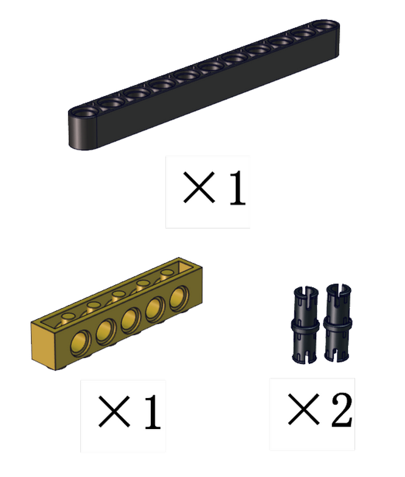
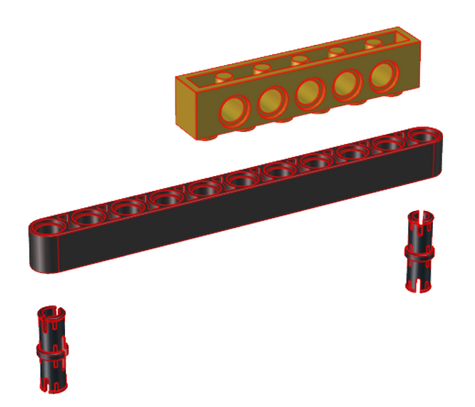
.. |image2| image:: img/5524822fee3e578da64fa98323a02c91.png
.. |image3| image:: img/af71c68c2096d0b9be62f8f1b90f5788.png
.. |image4| image:: img/cfc67549b45fdc99b20a5af6dead6dfd.png
.. |image5| image:: img/7a0786249dbabc401b3d3c144ba27f96.png
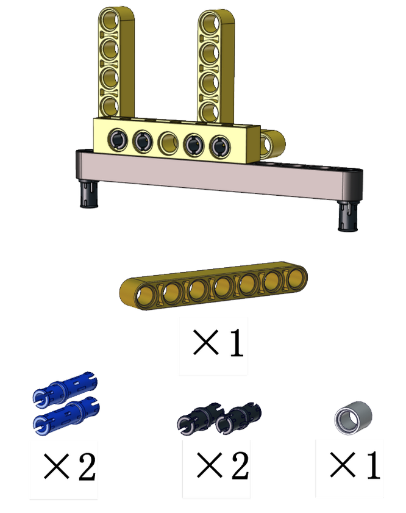
.. |image7| image:: img/884d0594a94508c143794ae4f93e3031.png
.. |image8| image:: img/1a1cbc3a9a330d17171c0367e6cf7926.png
.. |image9| image:: img/7cece542705c56e9f1069989882a59d1.png
.. |image10| image:: img/e4bf7576a162959e6177e13aaf3dbda8.png
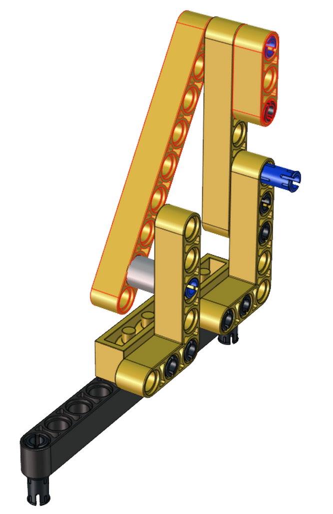
.. |image12| image:: img/87aba8f9d7da40c98584c29b35730fff.png
.. |image13| image:: img/076e6d8c2645691b836a9cc8a2a267ab.png
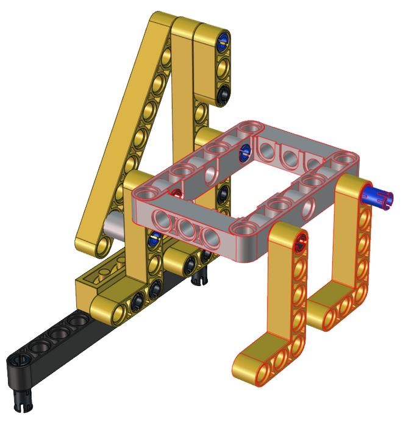
.. |image15| image:: img/5c09abb8e5652965cfbbc1cf1c1f1074.png
.. |image16| image:: img/dd6f5fb79caca05bb0737c50d21d9c71.png
.. |image17| image:: img/35fdb3fbae47f7b7bf36176eae68c05b.png
.. |image18| image:: img/7b8db88df9ea2672a28377cf6bc3d840.png
.. |image19| image:: img/23e700b90f41ae523999a0ce43e18869.png
.. |image20| image:: img/0d6a86d4dd911468a5ad23acb41af362.png
.. |image21| image:: img/7b694c4fd729cfc214eba81022145158.png
.. |image22| image:: img/67f7ee61f5908e636aa53290c491af3d.png
.. |image23| image:: img/560d08dce32498417d0a4a1aa3d42adf.png
.. |image24| image:: img/15e969bc6435c7ca54d1e982bd259e7d.png
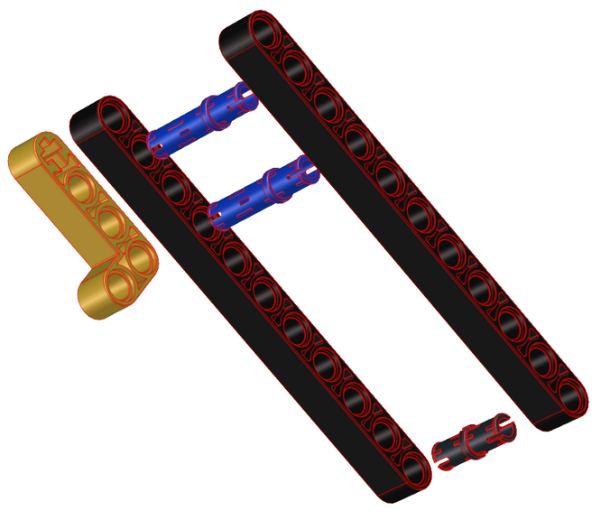
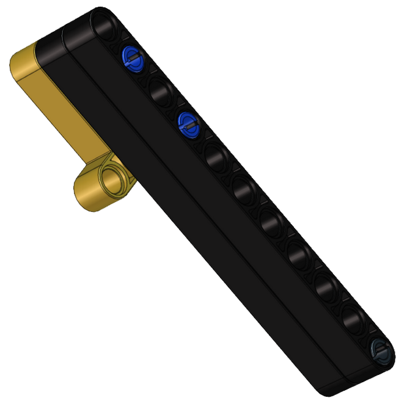
.. |image27| image:: img/d851de0a2e985ec8b2693b8ecf815f4c.png
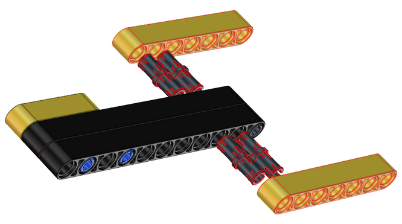
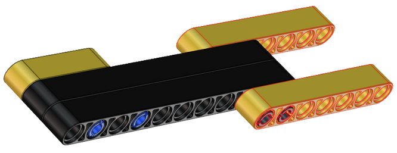
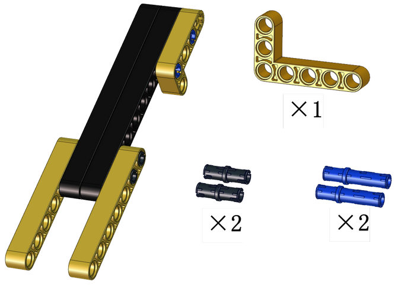
.. |image31| image:: img/2d05e0c9c6dee04c7783b266ed602074.png
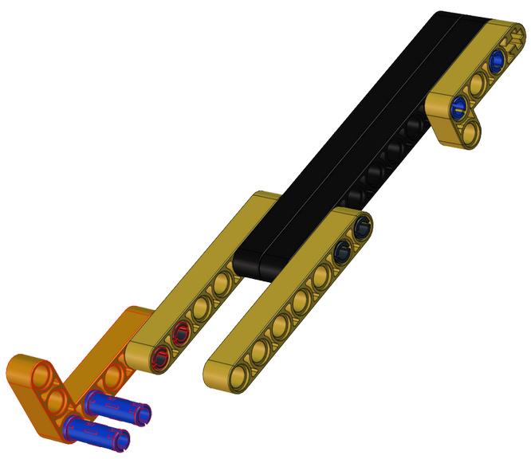
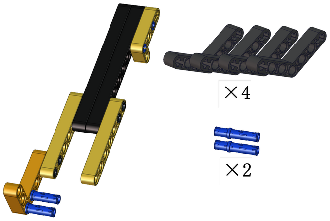
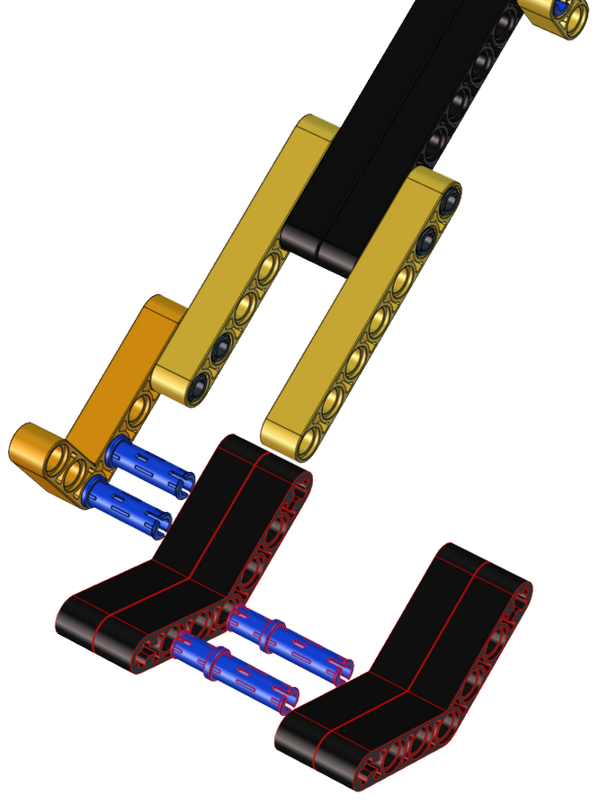
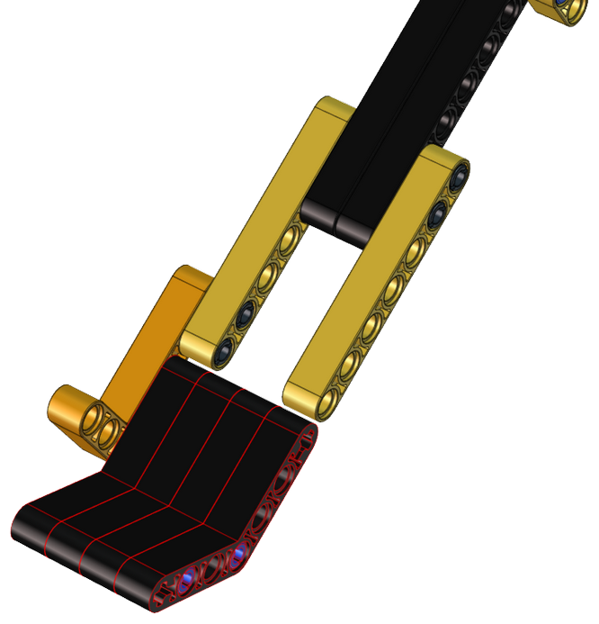
.. |image36| image:: img/093337079c3f016e15efbacce031474b.png
.. |image37| image:: img/4b55683a9b6da05c2e400242cc2f80a3.png
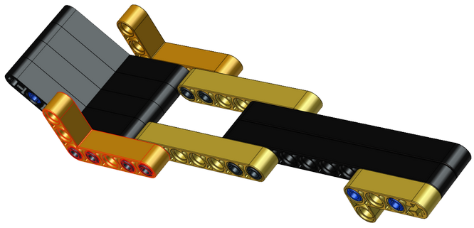
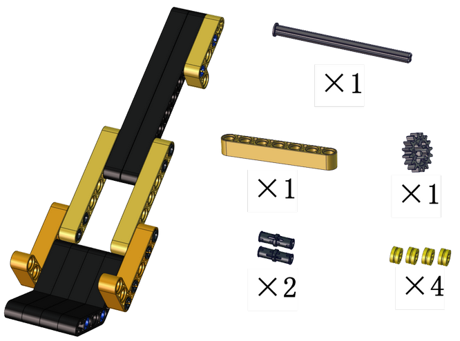
.. |image40| image:: img/8c0f13d7ee6013d273b0c7cf3f81189c.png
.. |image41| image:: img/e448a8422fcd6e17fc03f5fe5b330491.png
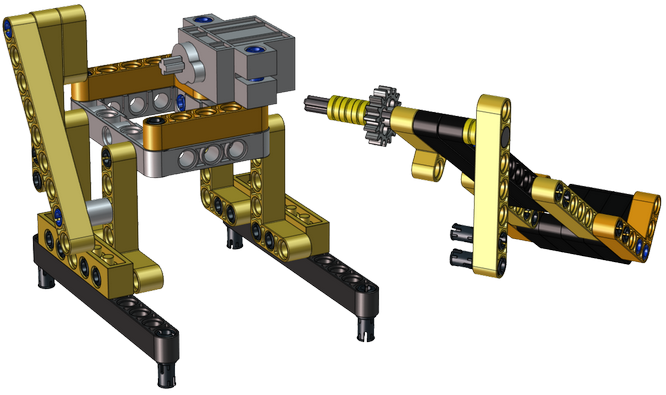
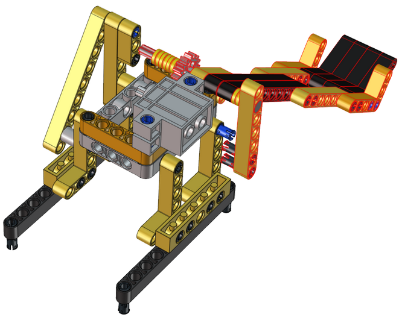
.. |image44| image:: img/5ce1bd3e98b3e3981e4715ce9c40746e.png
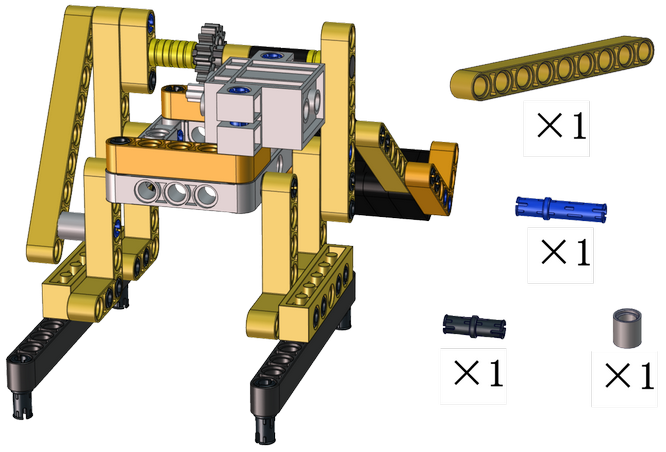
.. |image46| image:: img/d5e1244f2825a1b85772e414f4a434d8.png
.. |image47| image:: img/ff3e1fb83e913733c891fbde85051440.png
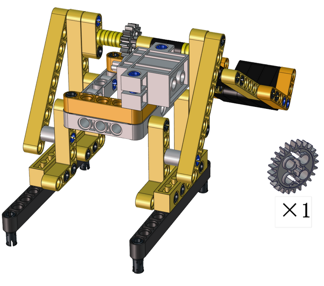
.. |image49| image:: img/c05bbcc57b7f3e8c1410c5a3d8f3fde8.png
.. |image50| image:: img/cbf249b15ba20b99cd1aa73a247b06fb.png
.. |image51| image:: img/4a8430468e88882e2c15238a926f4931.png
.. |image52| image:: img/68b29a156f020798ff4205123aa548ed.png
.. |image53| image:: img/3bfb5fd29681617f140d8f67c2c991c8.png
.. |image54| image:: img/f263b85fc91e8c7b35a6bc593416084e.png
.. |image55| image:: img/dce77bd674631f1b3f030db417fb67ea.png
.. |image56| image:: img/314d41aab13b7ef6e1a8dc9265065a32.png
.. |image57| image:: img/a6b5b27faa970fefb3a33c510a58bdd9.png
