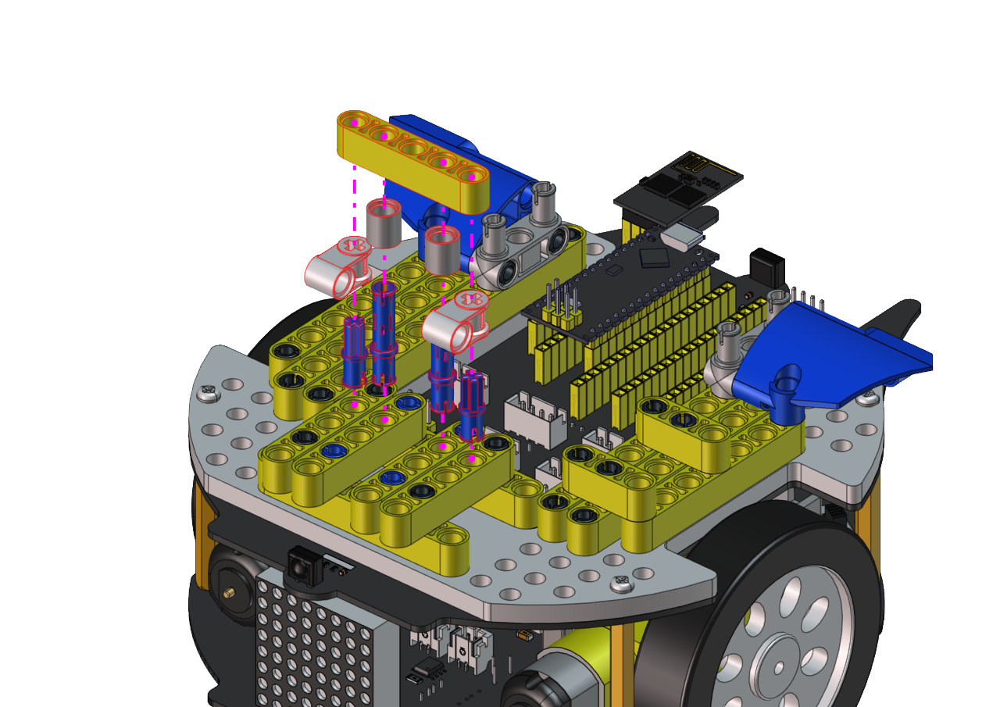
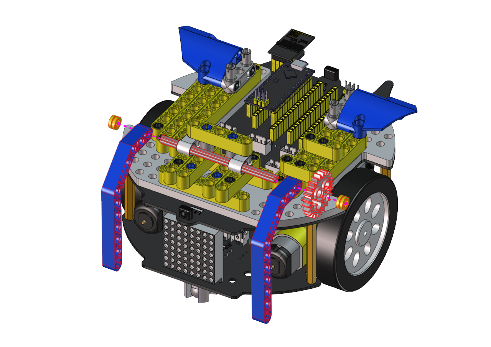
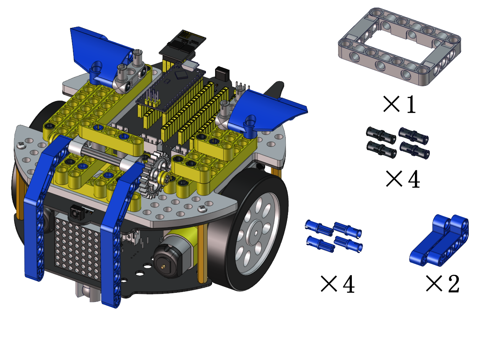
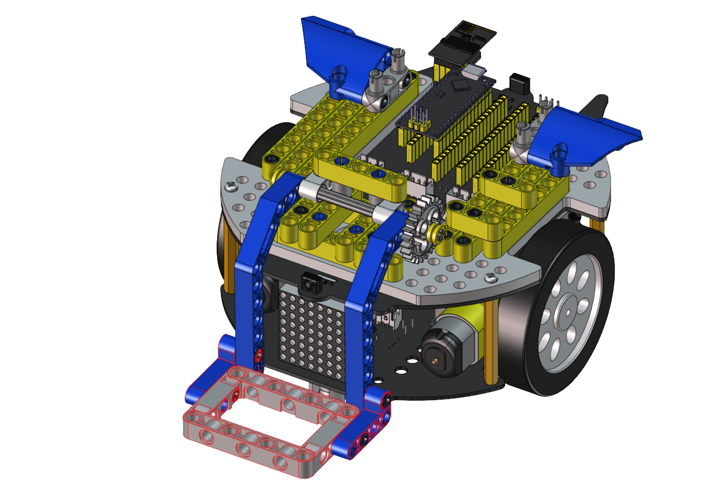
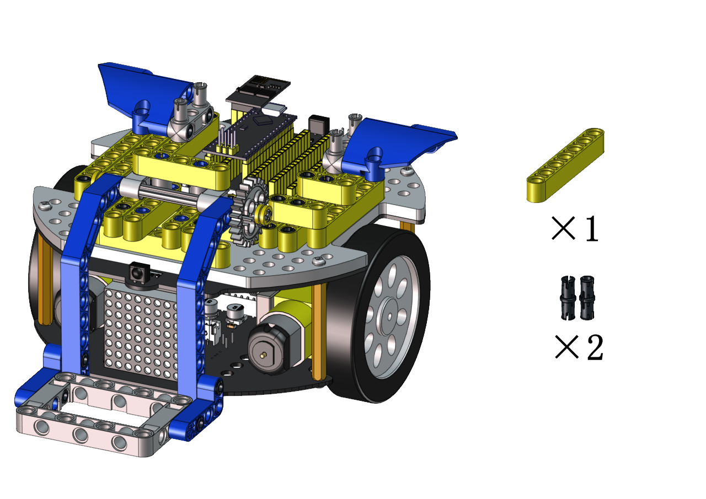
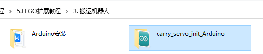
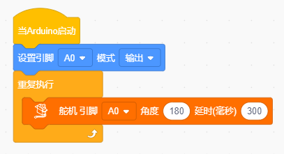
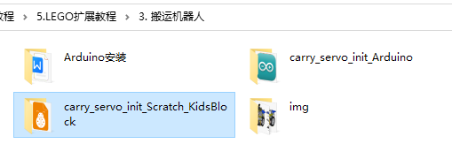
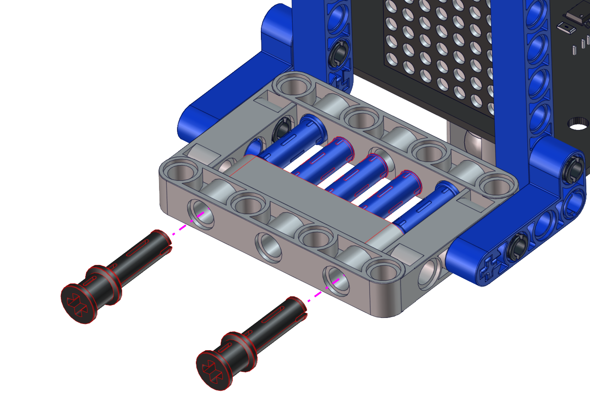

搬运机器人形态安装步骤
======================

将超声波云台拆下
----------------

|img|

--------------

安装所需零件
------------

|image1|

--------------

安装

|image2|

--------------

完成

|image3|

--------------

.. _安装所需零件-1:

安装所需零件
------------

|image4|

--------------

安装

|image5|

--------------

完成

|image6|

--------------

.. _安装所需零件-2:

安装所需零件
------------

|image7|

--------------

安装

|image8|

--------------

完成

|image9|

--------------

.. _安装所需零件-3:

安装所需零件
------------

|image10|

--------------

安装

|image11|

--------------

完成

|image12|

--------------

.. _安装所需零件-4:

安装所需零件
------------

|image13|

--------------

安装

|image14|

--------------

完成

|image15|

--------------

.. _安装所需零件-5:

安装所需零件
------------

|image16|

--------------

安装

|image17|

--------------

完成

|image18|

--------------

.. _安装所需零件-6:

安装所需零件
------------

|image19|

--------------

安装

|image20|

--------------

完成

|image21|

--------------

.. _安装所需零件-7:

安装所需零件
------------

|image22|

--------------

安装

|image23|

--------------

完成

|image24|

--------------

.. _安装所需零件-8:

安装所需零件
------------

|image25|

--------------

安装前需调节舵机角度为180°

将舵机的线接到PCB上板的S2接口，如下表:

====== =========
舵机   小车PCB板
====== =========
棕线   G
红线   5V
橙黄线 S2（A0）
====== =========

.. code:: c++

   #include <Servo.h>
   Servo myservo;  // create servo object to control a servo

   void setup() {
     myservo.attach(A0);  // attaches the servo on pin A0 to the servo object
   }

   void loop() {
     myservo.write(180);  // tell servo to go to position
   }

上面的Arduino代码在资料中有提供，打开舵机的调整代码并烧录到Beetlebot的主板，完成。代码如下图位置：

|image26|

也可以使用下面的Scratch-KidsBlock代码来调整舵机初始化角度.

|image27|

Scratch代码在资料中也有提供，打开舵机的调整代码并烧录到Beetlebot的主板，完成。代码如下图位置:

|image28|

--------------

安装（安装姿势与右图一致）

|image29|

--------------

完成

|image30|

--------------

.. _安装所需零件-9:

安装所需零件
------------

|image31|

--------------

安装

|image32|

--------------

安装

|image33|

--------------

完成

|image34|

--------------

完成

|image35|

--------------

完成
----

|image36|

--------------

舵机接线图
----------

舵机接到板子上的S2接口

|image37|

.. |img| image:: img/f05a58fdd61093240a78a884d2484bab.png
.. |image1| image:: img/1f8438657adee5ee0931a2e0db8c8d79.png
.. |image2| image:: img/b9cb95a5c53ab96b85b41d648c19534f.png
.. |image3| image:: img/502348fe825fa6e57cd61d1700c93c0f.png
.. |image4| image:: img/ca7778dd2175c92f92c86611b9fc64d3.png
.. |image5| image:: img/d33b93e264a8c2833ce2b3d4dcd91517.png
.. |image6| image:: img/c9a151d3856720e100dabe436d62d230.png
.. |image7| image:: img/a2b2a96f444801e2da559161cc5b2b65.png
.. |image8| image:: img/077d7de8e6260998b60e008593bff7e5.png
.. |image9| image:: img/a9a493a264445b0feab48159837fe725.png
.. |image10| image:: img/4570e1fc0c6b67a1012291d22a4882a9.png

.. |image12| image:: img/4a759b55f056a6cd9dfdee0cece5dfd1.png
.. |image13| image:: img/064acf2eab1416e7699f3478f1859536.png

.. |image15| image:: img/9b2185eaf2f66f35b57754d5476b1ddd.png

.. |image17| image:: img/7164d7dd08e97a62bc77ae08aadf1526.png

.. |image20| image:: img/7d32a51858167fd8aee486b72f287ae3.png
.. |image21| image:: img/83dbaa2175018608dc84f4dda726fa96.png
.. |image22| image:: img/6e73265906657a00ca17c5323f65dcec.png
.. |image23| image:: img/f60d276bb389be3c440b15adea292adf.png
.. |image24| image:: img/86f43f7d15cfb6c4ac807423b2510de0.png
.. |image25| image:: img/df4b2ab9b8ad767b948de6f783a0cf42.png

.. |image29| image:: img/014d0f844d18f7bbd2a80b7f1679fca1.png
.. |image30| image:: img/e66813dd3c1884b0c1f65bdf3f5b8c48.png
.. |image31| image:: img/13c2436b53b5dab5f508e902bcb6b0cf.png
.. |image32| image:: img/20149b66db795ce32fcb060a0823bab0.png
.. |image33| image:: img/b97e180d74ce41e7293acfe85a0b1bd7.png
.. |image34| image:: img/b1d1dd5fe42bc14bbf773e9e10cdcab9.png

.. |image36| image:: img/89d2a853cf95635fae60b5ec48482d54.png
.. |image37| image:: img/d21937e59f71e552c4deb19e1a91b6d3.png
